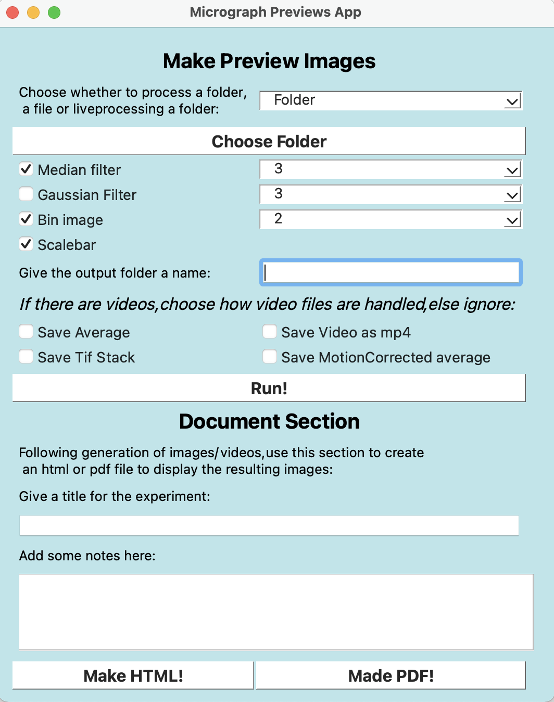

.. SimpliPyTEM documentation master file, created by
   sphinx-quickstart on Wed Nov 30 18:15:47 2022.
   You can adapt this file completely to your liking, but it should at least
   contain the root `toctree` directive.

Welcome to SimpliPyTEM's documentation!
=======================================

SimpliPyTEM is a python package to make python-based analysis of Transmission electron microscopy images easier and more approachable. Although TEM is the focus, this could also easily be adapted to other microscopy images. 
Importantly, SimpliPyTEM is designed to make automated, basic work accessible for beginners (through a simple GUI), while more complicated methods can be accessed through simple python code. This package centers around the image data being held in a Numpy array which makes the image data easy to access for further analysis. 

SimpliPyTEM also has a modules designed for *in situ* TEM videos, easily altering the functions to include these. 

This project aims to make use of the rapid automation of image analysis methods available through python while making it approachable for the user.

Functions to generate pdf and html files containing images and videos are also included in this package. This allows easy viewing and sharing of all the images/videos taken in an imaging session, making experiment evaluation significantly easier. 

 

SimpliPyTEM-GUI
---------------

Here I introduce an easy to use interface to automatically process files to do basic post-processing following a TEM imaging session. 

Using this to automate basic post-processing following a TEM imaging session has huge advantages in speed. For example, using the SimpliPyTEM GUI to process 5 files, including 2 video files (one of which was >2.5Gb in size) took <11s too generate 5 images on my Macbook. This was faster than the time it took for the largest file to load into FIJI. 

Combined with this, I have also created methods to make html or pdf files containing the images (or videos) taken, allowing for rapid evaluation and sharing of experimental data. 

This app is designed to be simple to use for people with basic computational skills.

.. toctree::
   :caption: GUI 

   SimpliPyTEM-GUI

.. image:: Media/Images/SimpliPyTEM_figures.001.png
    :width: 600
    :alt: Figure showing aim of SimpliPyTEM-GUI

SimpliPyTEM-Library
-------------------

While SimpliPy-GUI makes the basic post-processing simple, the SimpliPy-Library provides more powerful python-based methods, while still aiming to keep the functions simple.

This library contains several modules, including those for various post-processing and analysis of micrographs as well as microscope videos (see MicroVideo_class module), basic particle analysis functions (e.g. locating particles by simple thresholding and measuring properties) writing html and pdf documents. These methods aim to be easy to use and are fully documented in the links below. However, there are also 3 jupyter-notebook tutorials available to learn how to use, and give more details about these functions. These are found in the Tutorials folder where the package is installed, or can be downloaded individually from :ref:`the github-repo <https://github.com/gabriel-ing/Micrograph-analysis-scripts>`_.

Importantly, this library is especially useful for *in situ* TEM videos, as this is a rarer endevour but also my specific interest. 

This library aims to simplify python-based image analysis functions for beginner or intermediate python useds.

.. toctree::
   :maxdepth: 1
   :caption: Python Library

   Micrograph_class
   MicroVideo_class
   PDF_generator
   html_writer
   Particle_analysis

Tutorials
---------

Here are tutorials on how the python library can be used to process images and videos. 

.. toctree::
   :maxdepth: 1
   :caption: Tutorials

   Tutorials/MicrographAnalysisTutorial
   Tutorials/MicroVideoAnalysisTutorial
   Tutorials/Particle_analysis_tutorial

Installation
------------

To install, I recommend using miniconda, see here: https://docs.conda.io/en/latest/miniconda.html

Install miniconda and create a new environment, although it isn't strictly necessary to create a new environment this ensure the install doesn't create versions of libraries which conflict with the requirements of other installed libraries. 

``conda create --name SimpliPyTEM python=3.8``

After that you need to activate the environment, this needs to be done before every use.

``conda activate SimpliPyTEM``

Then you can download SimpliPyTEM using pip: 

``pip install SimpliPyTEM``

If you have any issues with the installation feel free to open a issue on the github repository: https://github.com/gabriel-ing/Micrograph-analysis-scripts and I can try to help. 

Following this the library should be accessible within python or jupyter-notebook scripts with: 

``from SimpliPyTEM.Micrograph_class import * #For example``

Indices
-------

* :ref:`genindex`
* :ref:`modindex`
* :ref:`search`

Licensing
---------
This project is licensed under the GPL-3.0 license.
