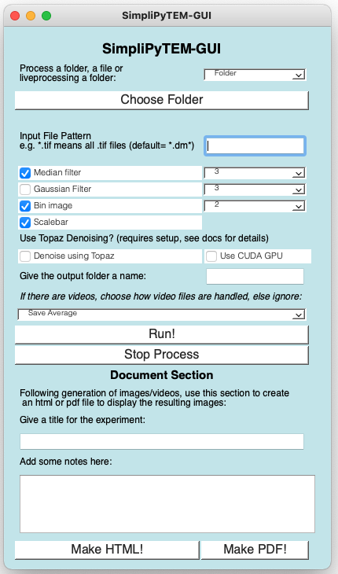

.. SimpliPyTEM documentation master file, created by
   sphinx-quickstart on Wed Nov 30 18:15:47 2022.
   You can adapt this file completely to your liking, but it should at least
   contain the root `toctree` directive.

Welcome to SimpliPyTEM's documentation!
=======================================

SimpliPyTEM is a python package to make python-based analysis of Transmission electron microscopy images easier and more approachable. Although TEM is the focus, this could also easily be adapted to other microscopy images. 
Importantly, SimpliPyTEM is designed to make automated, basic work accessible for beginners (through a simple GUI), while more complicated methods can be accessed through simple python code. This package centers around the image data being held in a Numpy array which makes the image data easy to access for further analysis. 

SimpliPyTEM also has a modules designed for *in situ* TEM videos, easily altering the functions to include these. 

This project aims to make use of the rapid automation of image analysis methods available through python while making it approachable for the user.

Functions to generate pdf and html files containing images and videos are also included in this package. This allows easy viewing and sharing of all the images/videos taken in an imaging session, making experiment evaluation significantly easier. 

SimpliPyTEM was mainly built for Gatan's DM4 files, however many other filetypes are now supported for basic functionality, this is known to include TIFs, MRCs, MP4s, AVIs. In addition, Hyperspy is  (as of July 2023) used for any unknown filetypes, this supports numerous different electron microscopy filetypes so feel free to try your files and see if it works. If the library would be useful to you but you cannot open your files, please open an issue on the github and I can discuss it further with you.

**Please note, software was developed on MacOS and Ubuntu linux, I do not know if there are any issues with Windows compatibility, I suspect there may be issues with file systems but I cannot confirm this. If anyone who has issues with this or other issues please raise an issue on the github page**

Any issues? Please report on the issues page on github.

Installation
------------
Please note, I have tested the package on Mac and Linux only, not Windows. Feel free to try using Windows, I imagine the python-library will be fine, however I don't have a windows computer to test the system on so am unsure if there will be issues.

To install, I recommend using miniconda, see here: https://docs.conda.io/en/latest/miniconda.html

Install miniconda and create a new environment, although it isn't strictly necessary to create a new environment this ensure the install doesn't create versions of libraries which conflict with the requirements of other installed libraries. 

``conda create --name SimpliPyTEM python=3.8``

After that you need to activate the environment, this needs to be done before every use.

``conda activate SimpliPyTEM``

Then you can download SimpliPyTEM using pip (firstly, update pip): 

``pip install --upgrade pip``

``pip install SimpliPyTEM``

If you have any issues with the installation, there is a short Troubleshooting section below with known errors, or feel free to open a issue on the github repository: https://github.com/gabriel-ing/SimpliPyTEM and I can try to help. 

Following this the library should be accessible within python or jupyter-notebook scripts with: 

``from SimpliPyTEM.Micrograph_class import * #For example``

and the GUI can be opened by typing into the command-line

``SimpliPyTEM-GUI``

*There is a common issue on linux machines with a QT plugin 'xcb', if you see this issue, there is a troubleshooting section at the bottom of the page, and further details on the `github issues page <https://github.com/gabriel-ing/SimpliPyTEM/issues/24>`_. Please try these and if you are still having issues report it on github. *

**Developer mode installation** 

If you wish to be able to edit the code after installation (maybe you want to add a feature or fix a bug, if so please share!), install from GitHub: 
:::

   git clone https://github.com/gabriel-ing/SimpliPyTEM.git

   cd SimpliPyTEM

   ##(I recommend making a clean conda environment here, as above)

   pip install -e . 

:::

SimpliPyTEM-GUI
---------------

Here I introduce an easy to use interface to automatically process files to do basic post-processing following a TEM imaging session. 

Using this to automate basic post-processing following a TEM imaging session has huge advantages in speed. For example, using the SimpliPyTEM GUI to process 5 files, including 2 video files (one of which was >2.5Gb in size) took <11s too generate 5 images on my Macbook. This was faster than the time it took for the largest file to load into FIJI. 

Combined with this, I have also created methods to make html or pdf files containing the images (or videos) taken, allowing for rapid evaluation and sharing of experimental data. 

This app is designed to be simple to use for people with basic computational skills.

.. toctree::
   :caption: GUI 

   SimpliPyTEM-GUI

.. image:: Media/Images/SimpliPyTEM_figures.001.png
    :width: 600
    :alt: Figure showing aim of SimpliPyTEM-GUI

SimpliPyTEM-Library
-------------------

While SimpliPy-GUI makes the basic post-processing simple, the SimpliPy-Library provides more powerful python-based methods, while still aiming to keep the functions simple.

This library contains several modules, including those for various post-processing and analysis of micrographs as well as microscope videos (see MicroVideo_class module), basic particle analysis functions (e.g. locating particles by simple thresholding and measuring properties) writing html and pdf documents. These methods aim to be easy to use and are fully documented in the links below. However, there are also 3 tutorials available within this documentation side (see left-hand side panel) to learn how to use, and give more details about these functions. These tutorials can also be downloaded and run on your own system, and are found in at SimpliPyTEM/docs/Tutorials where the package is installed, or can be downloaded individually from https://github.com/gabriel-ing/SimpliPyTEM.

Importantly, this library is especially useful for *in situ* TEM videos, as this is a rarer endevour but also my specific interest. 

This library aims to simplify python-based image analysis functions for beginner or intermediate python useds.

.. toctree::
   :maxdepth: 1
   :caption: Python Library
   
   Micrograph_class
   MicroVideo_class
   PDF_generator
   html_writer
   Particle_analysis

Tutorials
---------

Here are tutorials on how the python library can be used to process images and videos. 

.. toctree::
   :maxdepth: 1
   :caption: Tutorials

   Tutorials/MicrographAnalysisTutorial
   Tutorials/MicroVideoAnalysisTutorial
   Tutorials/Particle_analysis_tutorial

Installation Troubleshooting
----------------------------

This is a legacy error - it should have hopefully been fixed as of  version 1.0.6 (current version on pyPI)! However I am leaving it in case similar issues arise despite this.

I've come across some errors when installing the package, particularly in linux computers, one in particular relating to `qt.qpa.plugin`, it looks as follows
:::

      QObject::moveToThread: Current thread (0x26b9850) is not the object's thread (0x41d2cb0).
      Cannot move to target thread (0x26b9850)

      qt.qpa.plugin: Could not load the Qt platform plugin "xcb" in "/home/anaconda3/envs/New_test/lib/python3.8/site-packages/cv2/qt/plugins" even though it was found.
      This application failed to start because no Qt platform plugin could be initialized. Reinstalling the application may fix this problem.

      Available platform plugins are: xcb, eglfs, linuxfb, minimal, minimalegl, offscreen, vnc, wayland-egl, wayland, wayland-xcomposite-egl, wayland-xcomposite-glx, webgl.

      Aborted (core dumped)

:::
The solution I have found to fix this error is simply to delete the file `libqxcb.so` which is in /home/anaconda3/envs/New_test/lib/python3.8/site-packages/cv2/qt/plugins/platforms/ this pathway will be specific to your system and apart from the platforms directory is found on the third line of the error.

to remove this you can simply run 

   `rm /home/anaconda3/envs/New_test/lib/python3.8/site-packages/cv2/qt/plugins/platforms/libqxcb.so`

If there is still an error but it has changed after doing this, try uninstalling and reinstalling pyQT5: 

   `pip uninstall pyQT5`

   `pip install pyQT5==5.14`

Unfortunately making pyQT5==5.14 th default leads to the program not running on macs (at least on my computer), so I have not made this the default. 

Alternatively, one user has reported that uninstalling openCV and installing the 'headless' version also works:

   `pip uninstall opencv-python`
   `pip install opencv-python-headless`

Please let me know if you do have this or any other issues and I'll add to this! 

Indices
-------

* :ref:`genindex`
* :ref:`modindex`
* :ref:`search`

Licensing
---------
This project is licensed under the GPL-3.0 license.

Citing
------ 

If SimpliPyTEM is useful for your projects, please cite our manuscript at: 

:::

Ing G, Stewart A, Battaglia G, Ruiz-Perez L (2023) 
SimpliPyTEM: An open-source Python library and app to simplify transmission electron microscopy and in situ-TEM image analysis. 
PLoS ONE 18(10): e0285691. 
https://doi.org/10.1371/journal.pone.0285691
   
:::